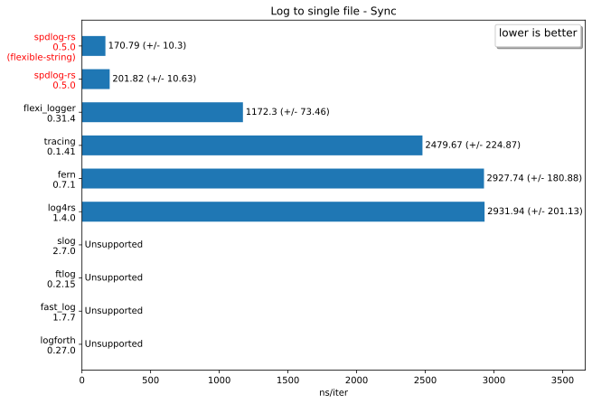
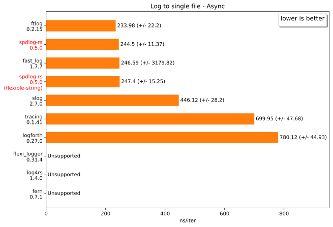
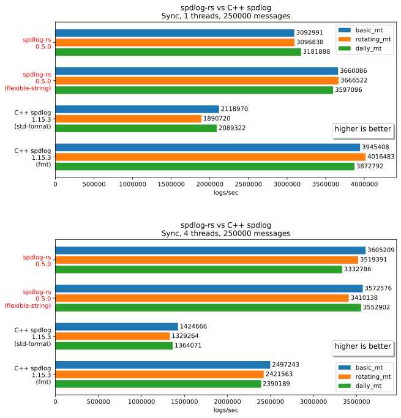
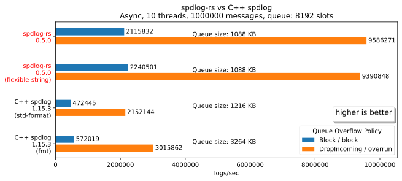

# Benchmarks

[The tracking page] for benchmark changes for each commit during development.

Run `just bench` in the root directory of this repository for benchmarking.

The following results are generated on `Windows 10 64 bit` and `Intel i9-10900KF CPU @ 3.70GHz` with `cargo 1.92.0-nightly (f2932725b 2025-09-24)`.

### `spdlog-rs` (0.5.0)

- Default features

  ```
  test bench_1_file               ... bench:         201.82 ns/iter (+/- 10.63)
  test bench_2_file_async         ... bench:         244.50 ns/iter (+/- 11.37)
  test bench_3_rotating_file_size ... bench:         197.51 ns/iter (+/- 36.44)
  test bench_4_rotating_daily     ... bench:         200.50 ns/iter (+/- 9.47)
  test bench_5_level_off          ... bench:           1.37 ns/iter (+/- 0.13)
  ```

- Enable `flexible-string` feature

  ```
  test bench_1_file               ... bench:         170.79 ns/iter (+/- 10.30)
  test bench_2_file_async         ... bench:         247.40 ns/iter (+/- 15.25)
  test bench_3_rotating_file_size ... bench:         172.91 ns/iter (+/- 27.18)
  test bench_4_rotating_daily     ... bench:         173.12 ns/iter (+/- 10.84)
  test bench_5_level_off          ... bench:           1.43 ns/iter (+/- 0.02)
  ```

### Compared with other Rust crates

> [!NOTE]
> Disclaimer: I'm not entirely familiar with using the other Rust crates below, so if you find a bug or something worth improving in the benchmark code, feel free to open an issue to let me know.

For the full benchmarking results data, see file [./results/data.toml](./results/data.toml).





### Compared with C++ spdlog

Compiler for C++ spdlog is `MSVC 19.44.35217.0`.





[The tracking page]: https://spriteovo.github.io/spdlog-rs/dev/benchmarks/
